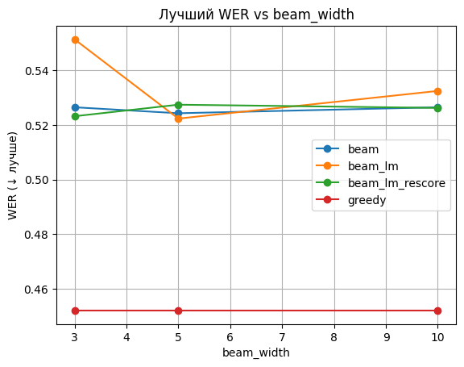
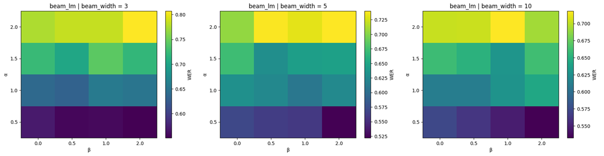
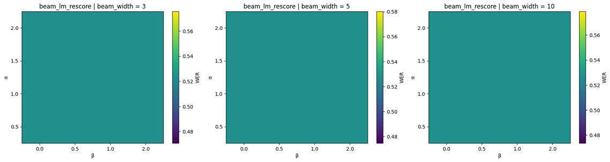

# Assignment 2 — ASR Decoding

## Задание
Реализованы четыре метода декодирования для модели **wav2vec2-base-960h**:
1. Greedy decoding  
2. Beam search decoding  
3. Beam search с LM shallow fusion  
4. Beam search с LM rescoring  

## Реализация
- Класс `Wav2Vec2Decoder` с четырьмя методами.  
- Используется акустическая модель wav2vec2 и 3-граммная LM KenLM.  
- Beam search реализован вручную, без внешних библиотек.  

## Эксперименты
- Тестировались 8 аудио-файлов.  
- Метрики: **CER** и **WER**.  
- Параметры: `beam_width`, `alpha`, `beta`, `rescoring_beams`.  
- Все результаты сохранены в `asr_experiments_results.csv`.  

## Графики
Лучшие результаты визуализированы:  

- Лучший WER vs beam_width  
  

- Время декодирования vs beam_width  
  

- Теплокарты WER для beam_lm  
  

- Теплокарты WER для beam_lm_rescore  
  

## Выводы
- Жадный декодер (greedy) оказался на удивление сильным.  
- Beam search без LM не дал улучшения.  
- LM fusion чувствителен к параметрам: при малых α и умеренных β есть улучшение, при больших α качество падает.  
- Второй проход (LM rescoring) почти не изменил результат, так как в биме мало альтернативных гипотез.  
- Время работы растёт линейно с увеличением beam_width.  

##Дополнительно

Для улучшения можно попробовать:
- более крупную LM (4- или 5-грамму),
- увеличенный beam_width,
- другие методы рескоринга (например, BERT LM).